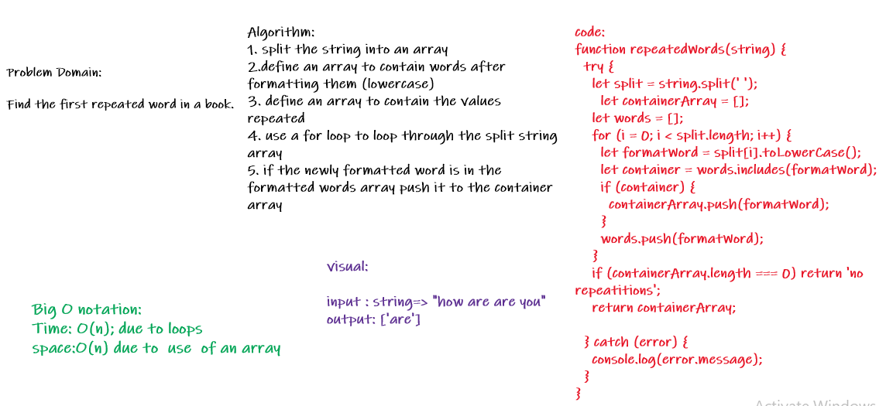

## Code Challenge: Class 31

- Find the first repeated word in a book.
 
 

## Feature Tasks
- Write a function called repeated word that finds the first word to occur more than once in a string
- Arguments: string
- Return: array
 
 

## whiteBoard

