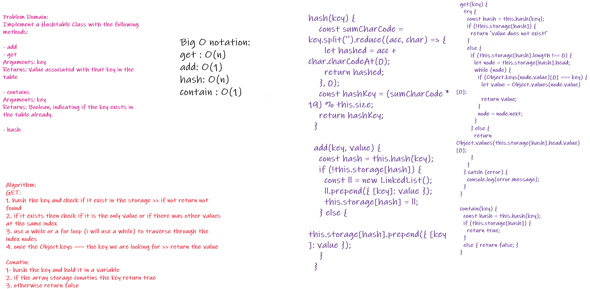
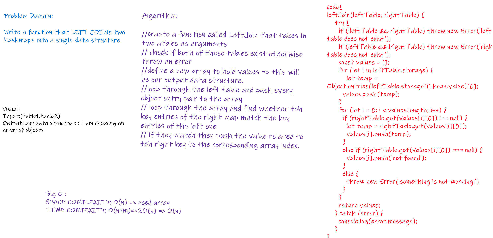

# Code Challenge: Class 30: Hash Table Implementation

## WhiteBoard:

# Features: 
## Implement a Hashtable Class with the following methods:

1. add
Arguments: key, value
Returns: nothing
This method should hash the key, and add the key and value pair to the table, handling collisions as needed.

2. get
Arguments: key
Returns: Value associated with that key in the table

3. contains
Arguments: key
Returns: Boolean, indicating if the key exists in the table already.

4. hash
Arguments: key
Returns: Index in the collection for that key

 

## leftJoin

### Write a function that LEFT JOINs two hashmaps into a single data structure.

- Write a function called left join
 - Arguments: two hash maps
- The first parameter is a hashmap that has word strings as keys, and a synonym of the key as values.
- The second parameter is a hashmap that has word strings as keys, and antonyms of the key as values.
- Return: The returned data structure that holds the results is up to you. It doesn’t need to exactly match the output below, so long as it achieves the LEFT JOIN logic.

