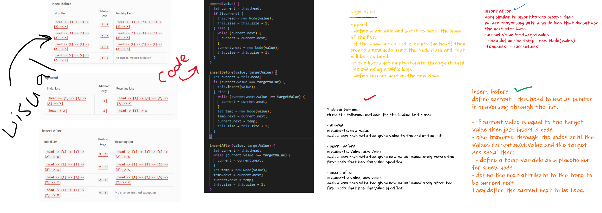

# Singly Linked List

+ Code Challenges 05 
+ Code Challenges 06

## Challenge

* Challenge 05: Create three prototype functions for single linked list class; insert, include, and toString

 
 

* Challenge 06: Create three prototype functions of linked list class; append, insert after, and insert before;

 
 

## Approach & Efficiency

I took the approach of minimizing big O space/time by keeping my functions simplistic and focused on only what was necessary to complete the task.
Big O space is O(1) and time is O(n);

 
 

## API

- .insert();
  - Insert a node at the beginning of a linked list

 
 

- .include();
  - Search for a value in a linked list and return true or false
  
 
 

- .toString()
  - Output a string of the contents of a linked list

 
 

- .append()
  - Add a node to the end of the linked list with a specified value
  
 
 

- .insertBefore()
  - Insert a node with a given value before a specified node

 
 

- .insertAfter()
  - Insert a node with a given value after a specified node;
  
 
 