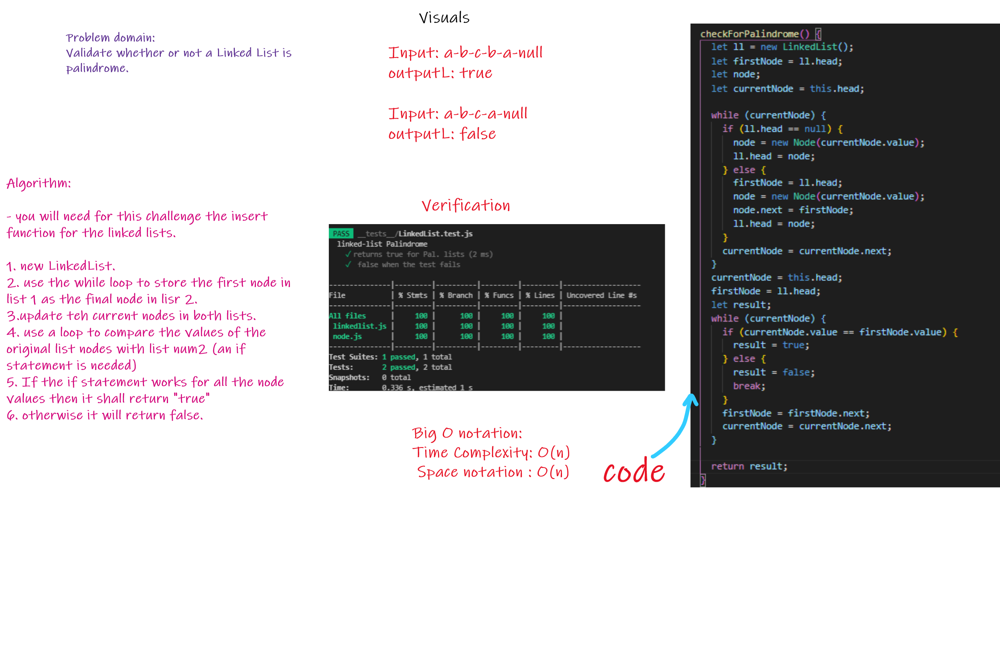

# Singly Linked List

+ Code Challenges 09

## Challenge

## WhiteBoard(paper)

## Approach & Efficiency

I took the approach of minimizing big O space/time by keeping my functions simplistic and focused on only what was necessary to complete the task.
Big O space is O(1) and time is O(n);

 
 

## API

- .insert();
  - Insert a node at the beginning of a linked list

 
 

- .include();
  - Search for a value in a linked list and return true or false
  
 
 

- .toString()
  - Output a string of the contents of a linked list

 
 

- .append()
  - Add a node to the end of the linked list with a specified value
  
 
 

- .insertBefore()
  - Insert a node with a given value before a specified node

 
 

- .insertAfter()
  - Insert a node with a given value after a specified node;
  
 
 

- .kthFromEnd() A function that finds the value kth from the end of the linked list

 
 

- Zip
- Arguments: 2 linked lists
Return: Linked List, zipped as noted below
Zip the two linked lists together into one so that the nodes alternate between the two lists and return a reference to the head of the zipped list.
