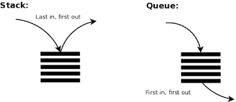

# Stacks and Queues

- **Stacks**
- **Queues**

## Challenge

### Stacks

- Define a method called `push` which takes any value as an argument and adds a new node with that value to the top of the stack with an O(1) Time performance.
- Define a method called `pop` that does not take any argument, removes the node from the top of the stack, and returns the node’s value. Should raise exception when called on empty stack
- Define a method called `peek` that does not take an argument and returns the value of the node located on top of the stack, without removing it from the stack.
Should raise exception when called on empty stack
- Define a method called `isEmpty` that takes no argument, and returns a boolean indicating whether or not the stack is empty.

### Queues

- Define a method called `enqueue` which takes any value as an argument and adds a new node with that value to the back of the queue with an O(1) Time performance.

- Define a method called `dequeue` that does not take any argument, removes the node from the front of the queue, and returns the node’s value. Should raise exception when called on empty queue
- Define a method called `peek` that does not take an argument and returns the value of the node located in the front of the queue, without removing it from the queue. Should raise exception when called on empty queue
- Define a method called `isEmpty` that takes no argument, and returns a boolean indicating whether or not the queue is empty.

## Approach & Efficiency
<!-- What approach did you take? Why? What is the Big O space/time for this approach? -->

## API

### Stacks

- `push` will take in a new value and add the new node with that value to the top of the stack
- `pop` will remove the node from the top and return the value
- `peek` will return the value of the node on the top of the stack without popping it
- `isEmpty` returns boolean statement if stack is empty or not

### Queues

- `enqueue` will take in a new node and add it to the back of the queue
- `dequeue` will remove the node from the front of the queue
- `peek` will return the value of the node on the front of the queue without popping it
- `isEmpty` returns boolean statement if queue is empty or not