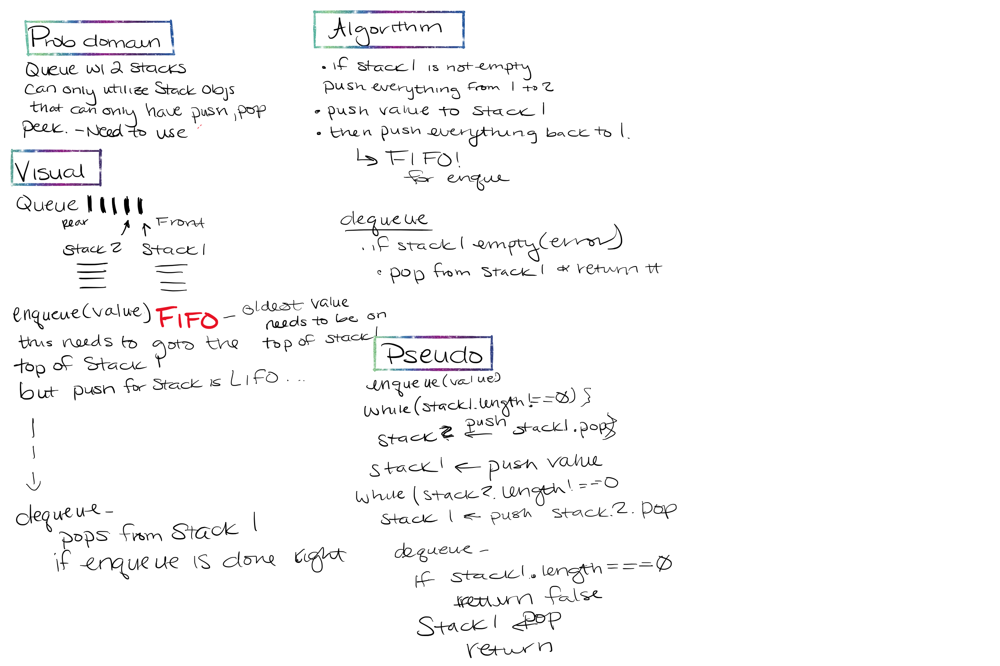

# Queue with Stacks

## Challenge Description

- Create a brand new `PseudoQueue` class. Do not use an existing Queue. Instead, this `PseudoQueue` class will implement our standard queue interface (the two methods listed below), but will internally only utilize 2 `Stack` objects. Ensure that you create your class with the following methods:

- `enqueue(value)` which inserts value into the PseudoQueue, using a **first-in, first-out** approach.
 

- `dequeue()` which extracts a value from the `PseudoQueue`, using a **first-in, first-out** approach.
 
 

## Approach & Efficiency

- `enqueue(value)` - time complexity of O(n)
- `dequeue()` - time complexity of O(1)
 
 

## Solution

- Whiteboard for Queues with Stacks
 
 

