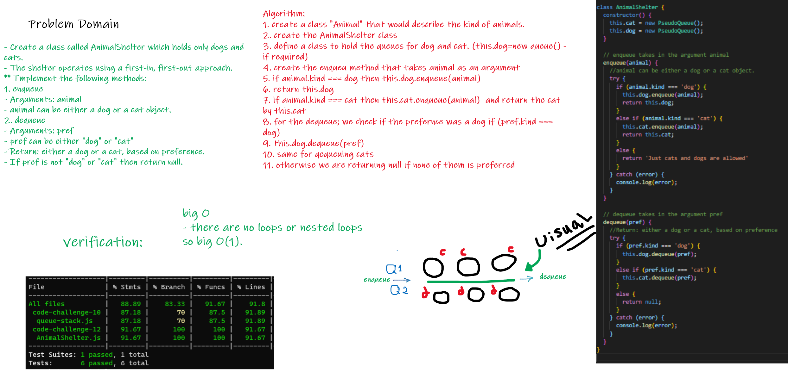

# First-in, First out Animal Shelter.

## Feature Tasks
- Create a class called `AnimalShelter` which holds only dogs and cats.
- The shelter operates using a first-in, first-out approach.

* Implement the following methods:
1. enqueue
     - Arguments: animal 
                - animal can be either a `dog` or a `cat` object.

2. dequeue
     - Arguments: pref
                 - `pref` can be either `"dog"` or `"cat"`.  
                 - Return: either a dog or a cat, based on preference. 

- If `pref` is not `"dog"` or `"cat"` then return null.

 
 

## Effieciency
- Using this method we can enqueue and dequeue with a big O(1).

 
 

## WhiteBoard

## Tests

To run the tests use the following command:
`npm run test`

