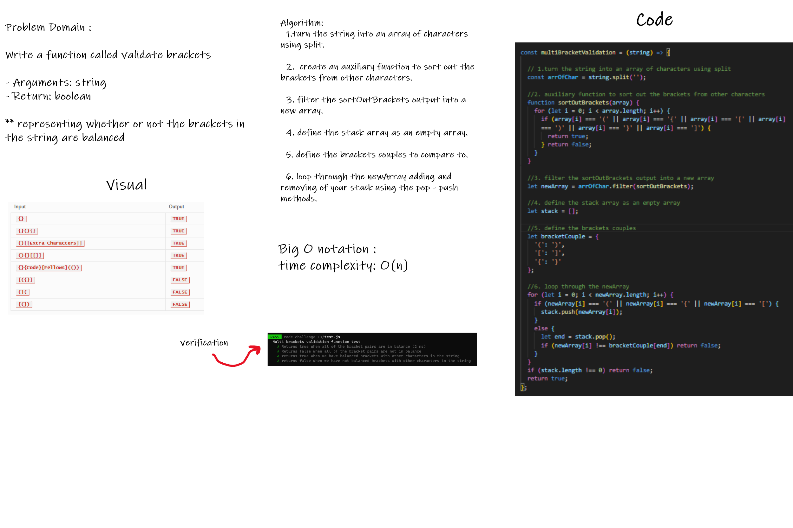

# Code Challenge: Class 13

 ## Multi-bracket Validation
 <br/>
 
 ###  **Write a function called validate brackets** :

     - Arguments: string
     - Return: boolean

 <br/>
 <br/>

## **representing whether or not the brackets in the string are balanced**

<br/>

- There are 3 types of brackets:

1. Round Brackets : `()`
2. Square Brackets : `[]`
3. Curly Brackets : `{}`

<br/>
<br/>

## Whiteboard 



<br/>
<br/>

## Example

INPUT | OUTPUT
-----|-----
`{}`	| TRUE
`{}(){}`	| TRUE
`()[[Extra Characters]]`	| TRUE
`(){}[[]]`	| TRUE
`{}{Code}[Fellows](())`	| TRUE
`[({}]`	| FALSE
`(](`	| FALSE
`{(})`	| FALSE

<br/>
<br/>


## Consider these small examples and why they fail.

INPUT | OUTPUT | WHY
-----|-----|-----
`{`	| FALSE	| error unmatched opening `{` remaining.
`)`	| FALSE	| error closing `)` arrived without corresponding opening.
`[}`	| FALSE	| error closing `}`. Doesn’t match opening `(`.

<br/>
<br/>

## Approach & Efficiency

- This solution requires has the time complexity with a big O notation O(n);

- Tests are in the `test.js` file attached to this folder.


> To run all the tests : 
> ``` run npm test ```