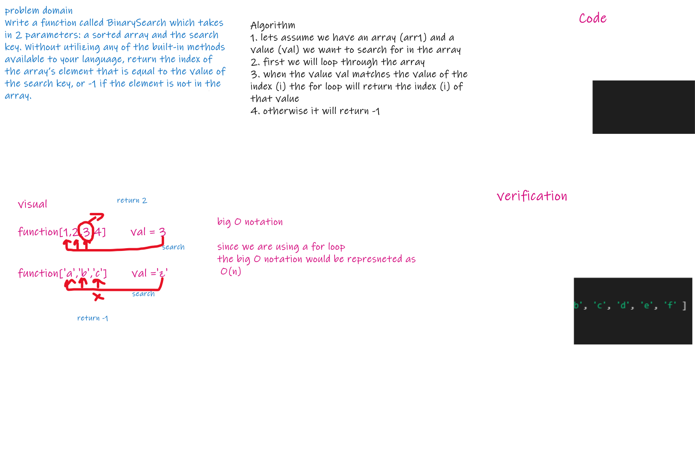
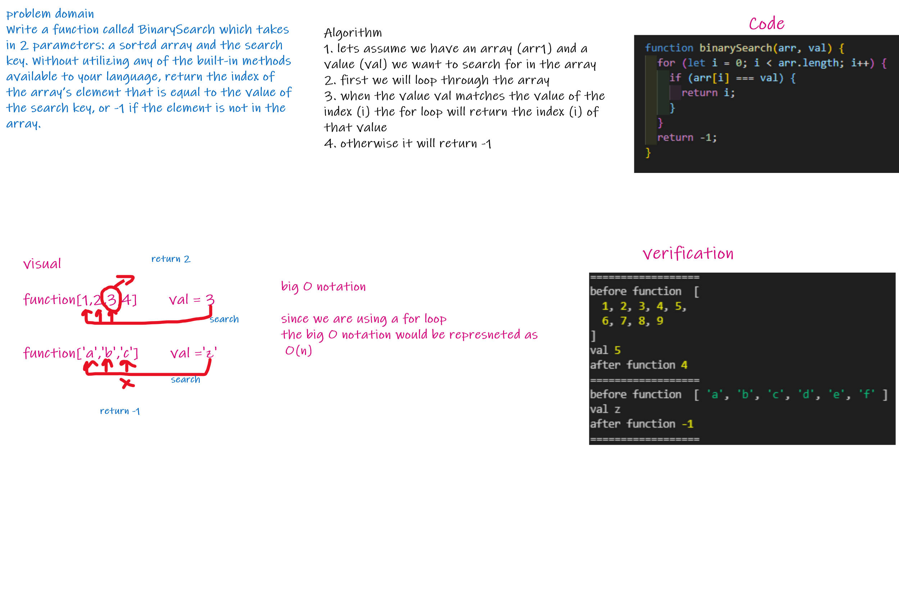

# Code Challenge: Class 03
# BinarySearch 
<!-- Description of the challenge -->
- We are required to create an algorithm through which we can search for a value in an array and return either the index where the value is placed or -1 if the value doesn't exist in the array .

## Whiteboard Process
<!-- Embedded whiteboard image -->

### svg format

---

### png format 

 
 
 
 

## Approach & Efficiency

- The Approach used is by making use of the for loops and loop through it till we match the condition and if the value equaled one of the inputs of the array we will return the index of that value in the array otherwise return -1.
