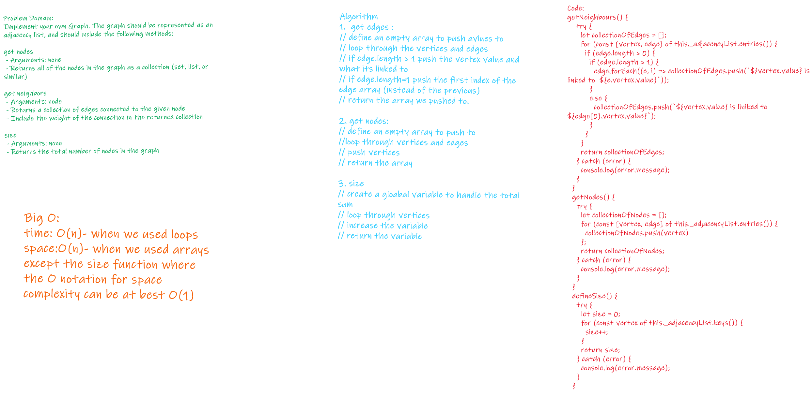

# Implementation: Graphs

NOTE: In class we did the first two functions.

## WhiteBoard

 
 

## Implement your own Graph. The graph should be represented as an adjacency list, and should include the following methods:

### add node
- Arguments: value
- Returns: The added node
Add a node to the graph
 

### add edge
- Arguments: 2 nodes to be connected by the edge, weight (optional)
- Returns: nothing
>Adds a new edge between two nodes in the graph
If specified, assign a weight to the edge
Both nodes should already be in the Graph
 

### get nodes
- Arguments: none
- Returns all of the nodes in the graph as a collection (set, list, or similar)
 

### get neighbors
- Arguments: node
- Returns a collection of edges connected to the given node
>Include the weight of the connection in the returned collection
 

### size
- Arguments: none
- Returns the total number of nodes in the graph
 

 
 
 

## WhiteBoard
