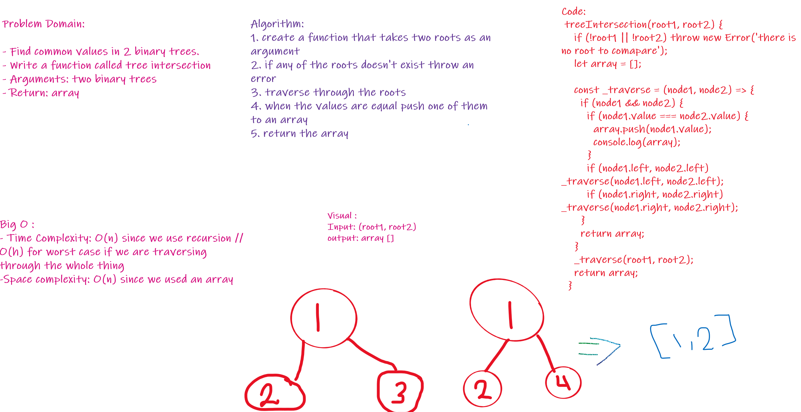

# Code Challenge: Class 32

## Feature Tasks
- Find all values found to be in 2 binary trees
 
 

- Write a function called tree intersection
- Arguments: two binary trees
- Return: array
 
 
 

## whiteBoard
