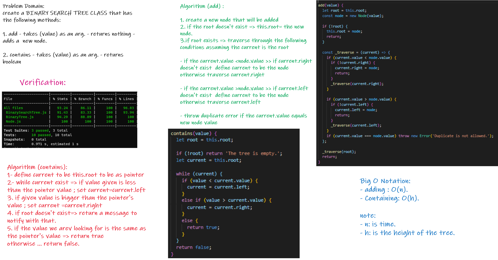

# Implementation: Trees

## WhiteBoard


<br/>

##  Features
1. Node
- Create a Node class that has properties for the value stored in the node, the left child node, and the right child node.
<br/>
<br/>


2. Binary Tree
- Create a Binary Tree class<br/>
- Define a method for each of the depth first traversals:

        1. pre order
        2. in order
        3. post order
 which returns an array of the values, ordered appropriately.

- Any exceptions or errors that come from your code should be semantic, capture-able errors. 
<br/>
<br/>


3. Binary Search Tree
- Create a Binary Search Tree class
     -This class should be a sub-class (or your languages equivalent) of the Binary Tree Class, with the following additional methods:
     <br/>
     <br/>

     
 1. Add
    - Arguments: value.
    - Return: nothing.
 - Adds a new node with that value in the correct location in the binary search tree.
<br/>
<br/>


  2. Contains
   - Argument: value
   - Returns: boolean indicating whether or not the value is in the tree at least once.
   <br/>
    <br/>

## Test
```npm run test``` 
<br/>


```npm run watch```
<br/>
<br/>

## Efficiency
- Time :
add - O(n)
contains - O(h); h:the hight of tree.