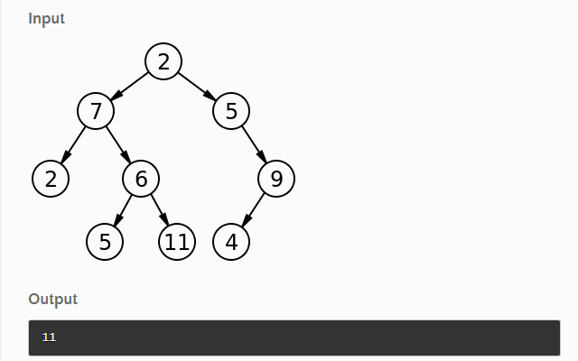

# Code Challenge: Class 16

# Feature Tasks
- Write the following method for the Binary Tree class

       - find maximum value
       - Arguments: none
       - Returns: number

- Find the maximum value stored in the tree. You can assume that the values stored in the Binary Tree will be numeric.


## Visual example: 
<br/>



<br/>
<br/>


## Whiteboard solution:


<br/>
<br/>

## Approach and efficiency
- Time complexity : O(n)


<br/>
<br/>


## Test

```npm run test``` 

<br/>


```npm run watch```

<br/>
<br/>