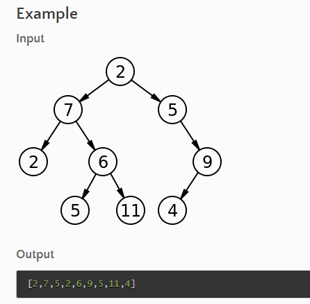
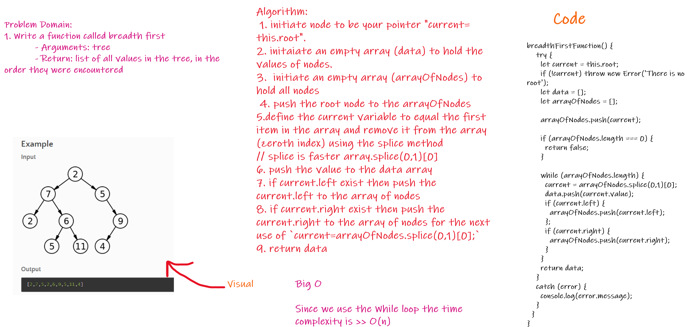

# Code Challenge: Class 17


## Feature Tasks
## Write a function called breadth first
    - Arguments: tree
    - Return: list of all values in the tree, in the order they were encountered

> NOTE: Traverse the input tree using a Breadth-first approach

<br/>

## Visual example: 


<br/>
<br/>


## Whiteboard:



<br/>
<br/>

## Test

```npm run test``` 

<br/>


```npm run watch```

<br/>


