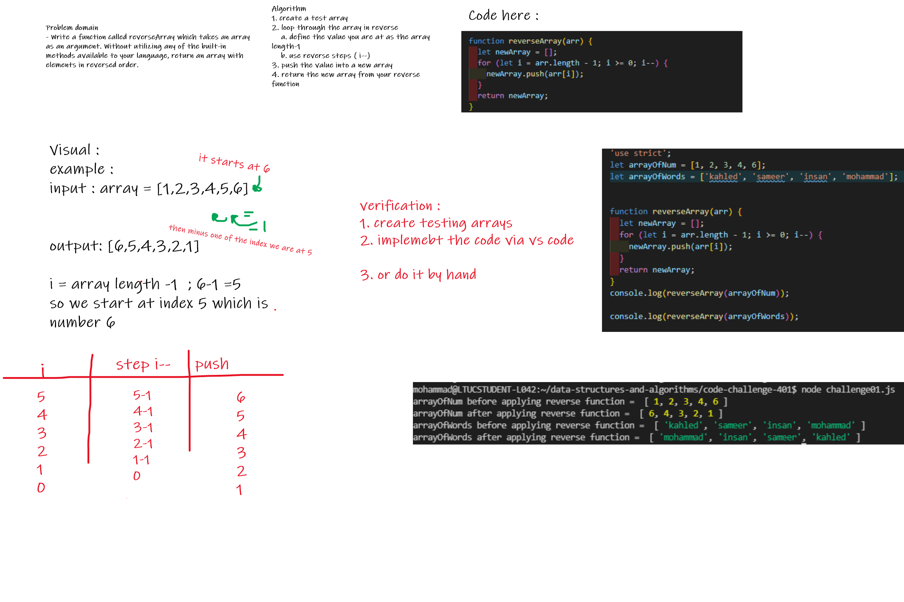

# Code Challenge: Class 01
# Reverse an Array
<!-- Description of the challenge -->
we are required to create an algorithm through which we can reverse the elements arrangement in an array.

## Whiteboard Process
<!-- Embedded whiteboard image -->

### svg format

---

### png format 

 
 
 
 

## Approach & Efficiency

- Approach used is by making use of the for loops and the reverse steps (i--), as well as defining the current value by the length of that array -1 because of the index.

