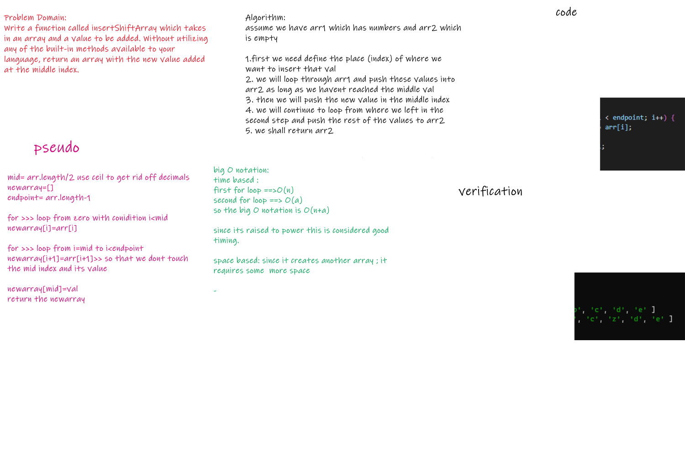
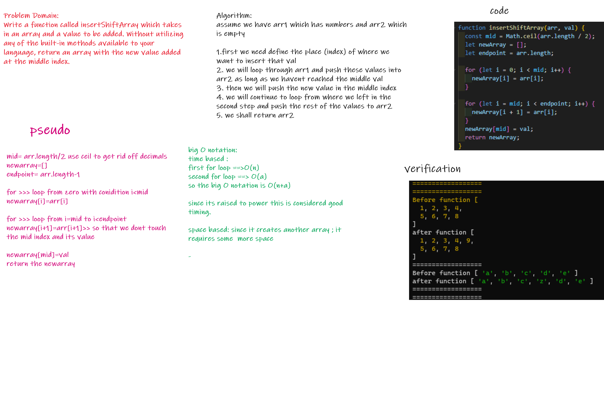

# Code Challenge: Class 02
# array insert shift
<!-- Description of the challenge -->
we are required to create an algorithm through which we can insert a value in the middle index of an array.
 
 

## Whiteboard Process
---

 
 

### svg format

---

### png format 

 
 
 
 

## Approach & Efficiency
---
 

1. defined the place of the middle value (index)
2. I made us of the for loop concept
   a. looped from 0 index (first value) till i reached the value before the mid index and pushed the values into the new array
   b. looped from after the mid value to the last index  and pushed all the values
   c. defined the middle index to hold the value of the element to be inserted
3. returned the new array 